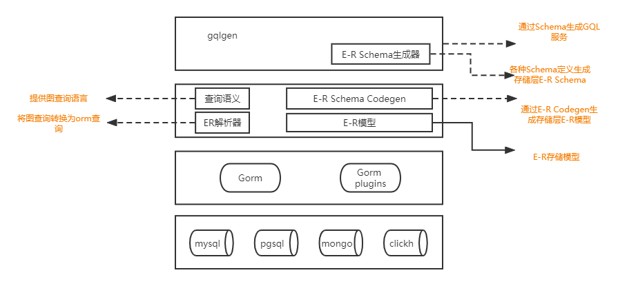

# era 

> 实体框架era (entity and relation in all)设计




- 基于gqlgen E-R定义生成era Schema  -- 参考entgql
- 基于era Schema定义生成数据E-R模型 -- 参考entc
- 提供Schema的图查询能力            -- 参考entql
- 使用Gorm操作与数据库交互          -- 参考gorm

era.大致主要包含一下四个部分：

## Schema 生成器（erac）

> 用户通过Schema生成器的定义语言定义Schema的实体、边、属性、注解等内容。
> 经由Schema生成器生成多种协议的实体和关系的抽象，进一步生成各种图查询的实体和关系的协议，例如gqlgen的schema协议。

操作步骤：
- 定义实体
- 执行 ```shell go generate ./... ```生成实体-关系抽象，同时生成指定的schema协议（例如gqlgen schema定义）

## GraphQL server（eragql）

> 通过erac生成gqlgen schema，使用gqlgen对外提供GraphQL服务

执行步骤：
- 定义实体
- 执行 ```shell go generrate ./...```生成代码和服务
- 实现服务接口 （使用eraql）
- 运行服务

## 图数据库查询语言 （earql）

> gorm兼容了多种数据库驱动。eraql是基于gorm实现的数据库图查询语言。

操作步骤：
- 链接数据库
- 完成数据库迁移 （实体-关系模型到数据表的映射）
- 执行图查询

## 存储层实体-关系模型（era）

> 基于erac生成的实体-关系抽象
> 基于eraql图查询语言
> 结合实体框架模板
> 生实体框架代码

操作步骤：

- 通过erac定义实体
- 执行```shell go generate ./... ``` 生成实体-关系存储层方法
- 链接数据库、完成数据迁移、执行图查询
